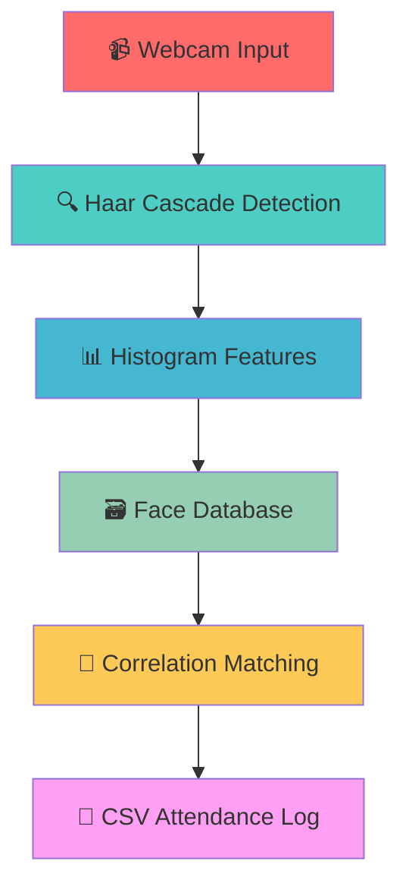

<div align="center">

# 🎯 Face Recognition Attendance System


[](https://opensource.org/licenses/MIT)
[](https://www.python.org/downloads/)
[](https://flask.palletsprojects.com/)
[](https://opencv.org/)
[](CONTRIBUTING.md)


### 🚀 Sistem absensi otomatis menggunakan teknologi computer vision untuk mengenali wajah karyawan secara real-time dengan antarmuka web yang modern.


</div>

---

## ✨ Features

<table>
<tr>
<td width="50%">

### 🎥 **Core Features**
- 🔍 **Real-time Face Recognition** - Deteksi wajah dengan OpenCV Haar Cascade
- 🌐 **Modern Web Interface** - Flask web app dengan Bootstrap UI
- 📱 **Responsive Design** - Berfungsi di desktop dan mobile
- 🔒 **Anti-duplicate System** - Mencegah absen ganda dalam satu hari
- 📊 **CSV Data Export** - Export data kehadiran ke file CSV

</td>
<td width="50%">

### 🎨 **UI/UX Features**
- ✨ **Glassmorphism Design** - Efek kaca transparan modern
- 🎭 **3D Card Effects** - Animasi kartu 3D interaktif
- 💫 **Neon Glow Effects** - Efek cahaya neon pada video
- 🎪 **Floating Animations** - Elemen melayang yang smooth
- 🧲 **Magnetic Buttons** - Tombol interaktif dengan hover effects

</td>
</tr>
</table>

<div align="center">

</div>

---

## 🚀 Quick Start

<div align="center">

</div>

### 📋 Prerequisites

```bash
✅ Python 3.8+
✅ Webcam/Camera  
✅ Modern web browser (Chrome, Firefox, Edge)
```

### 🛠️ Installation

<details>
<summary>📦 <b>Click to expand installation steps</b></summary>

```bash
# 📥 Clone repository
git clone https://github.com/yourusername/face-recognition-attendance.git
cd face-recognition-attendance

# 🐍 Create virtual environment
python -m venv venv

# ⚡ Activate virtual environment
# Linux/macOS:
source venv/bin/activate
# Windows:
venv\Scripts\activate

# 📦 Install dependencies
pip install -r requirements.txt

# 🚀 Run web application
python app.py
```

</details>

<div align="center">

### 🌐 Akses aplikasi di: **http://localhost:5000**


</div>

---

## 📖 Usage Guide


<table>
<tr>
<td width="25%" align="center">

<h3>1️⃣ Register</h3>
<p>Daftarkan wajah karyawan</p>
</td>
<td width="25%" align="center">

<h3>2️⃣ Attendance</h3>
<p>Scan wajah untuk absen</p>
</td>
<td width="25%" align="center">

<h3>3️⃣ View Data</h3>
<p>Lihat data kehadiran</p>
</td>
<td width="25%" align="center">

<h3>4️⃣ Diagnostics</h3>
<p>Test kamera</p>
</td>
</tr>
</table>

### 🎯 Web Interface

<details>
<summary>🏠 <b>Dashboard (http://localhost:5000)</b></summary>

- 🎥 Live camera feed dengan face recognition
- 🔄 Auto-scan setiap 3 detik atau manual scan
- 📊 Statistik kehadiran hari ini
- 🎨 Premium UI dengan glassmorphism effects

</details>

<details>
<summary>👤 <b>Register Face (/register)</b></summary>

- ✍️ Input nama karyawan
- 📸 Capture foto dengan webcam
- 💾 Simpan ke folder `faces/`
- ✅ Konfirmasi registrasi berhasil

</details>

<details>
<summary>📊 <b>Attendance Data (/attendance)</b></summary>

- 📋 Tabel data kehadiran lengkap
- 🔍 Filter berdasarkan tanggal
- 📈 Statistik kehadiran real-time
- 💾 Export data ke CSV

</details>

<details>
<summary>🔧 <b>Camera Test (/camera-test)</b></summary>

- 🎥 Test kamera dan troubleshooting
- 📊 Performance metrics real-time
- 🔍 Device detection dan diagnostics
- 📥 Download diagnostic report

</details>

### 💻 CLI Version

```bash
# Daftarkan wajah (CLI)
python register_face.py

# Jalankan attendance (CLI)
python face_recognition.py

# Lihat data kehadiran (CLI)
python view_attendance.py
```

---

## 🏗️ Architecture

<div align="center">

</div>



### 🛠️ Tech Stack

<div align="center">

| Backend | Frontend | Computer Vision | Database | UI Framework |
|---------|----------|----------------|----------|-------------|
|  |  |  |  |  |
|  |  |  |  |  |

</div>

---

## 📁 Project Structure

<div align="center">

</div>

```
🎯 face-recognition-attendance/
├── 📂 static/                    # Web assets
│   ├── 🎨 css/
│   │   ├── style.css            # Main styling dengan tema merah-putih
│   │   ├── effects.css          # Premium effects (glassmorphism, 3D)
│   │   ├── text-fixes.css       # Text visibility fixes
│   │   └── camera-test.css      # Camera diagnostics styling
│   ├── ⚡ js/
│   │   ├── app.js              # Core JavaScript functionality
│   │   └── premium-effects.js   # Interactive effects (magnetic, tilt)
│   └── 🎯 favicon.svg          # App icon
├── 🌐 templates/                # Flask templates
│   ├── index.html              # Dashboard dengan live camera
│   ├── register.html           # Face registration form
│   ├── attendance.html         # Data viewer dengan filter
│   └── camera_test.html        # Camera diagnostics
├── 👥 faces/                    # Face database (images)
├── 🚀 app.py                   # Flask web application
├── 🤖 face_recognition.py      # CLI version
├── 📝 register_face.py         # CLI registration
├── 📊 view_attendance.py       # CLI data viewer
├── 📈 attendance.csv           # Attendance data
├── 📦 requirements.txt         # Python dependencies
├── 🔧 run.sh                   # CLI launcher
├── 🌐 run_web.sh              # Web launcher
├── 📖 README.md               # Documentation
├── ⚖️ LICENSE                 # MIT License
├── 🤝 CONTRIBUTING.md         # Contribution guide
└── 📋 CODE_OF_CONDUCT.md      # Code of conduct
```

---

## 🔧 Algorithm Details

<div align="center">

</div>

### 🎯 Face Detection
- **Haar Cascade Classifier** - OpenCV pre-trained model
- **Real-time Processing** - 30 FPS detection rate
- **Multi-scale Detection** - Deteksi wajah berbagai ukuran

### 📊 Feature Extraction
- **Histogram Analysis** - Ekstraksi fitur dari grayscale image
- **Normalization** - Normalisasi histogram untuk konsistensi
- **Feature Vector** - 256-dimensional feature representation

### 🔄 Face Matching
- **Correlation Coefficient** - Perbandingan similarity antar wajah
- **Confidence Threshold** - 0.7 minimum untuk recognition
- **Best Match Selection** - Pilih wajah dengan skor tertinggi

### ⚙️ Configuration

```python
# Adjust recognition sensitivity
best_score = 0.7  # Lower = more sensitive (0.5-0.8)

# Change auto-scan interval
recognition_cooldown = 3  # seconds

# Modify detection parameters
faces = face_cascade.detectMultiScale(gray, 1.1, 4)
#                                    scale, neighbors
```

---

## 📊 Performance

<div align="center">

</div>

<table align="center">
<tr>
<td align="center">

</td>
<td align="center">

</td>
</tr>
<tr>
<td align="center">

</td>
<td align="center">

</td>
</tr>
</table>

### 🌐 Browser Support

<div align="center">


</div>

---

## 🤝 Contributing

<div align="center">

</div>

We welcome contributions! Please see our [Contributing Guide](CONTRIBUTING.md) for details.

### 🚀 Quick Contribution Steps

```bash
1️⃣ Fork the repository
2️⃣ Create feature branch: git checkout -b feature/amazing-feature
3️⃣ Commit changes: git commit -m 'Add amazing feature'
4️⃣ Push to branch: git push origin feature/amazing-feature
5️⃣ Open a Pull Request
```

<div align="center">

### 🏆 Contributors

<a href="https://github.com/yourusername/face-recognition-attendance/graphs/contributors">
  
</a>

</div>

---

## 🐛 Issues & Support

<div align="center">

</div>

<table>
<tr>
<td align="center">
<a href="https://github.com/yourusername/face-recognition-attendance/issues">

</a>
</td>
<td align="center">
<a href="https://github.com/yourusername/face-recognition-attendance/issues">

</a>
</td>
</tr>
<tr>
<td align="center">
<a href="https://github.com/yourusername/face-recognition-attendance/discussions">

</a>
</td>
<td align="center">
<a href="/camera-test">

</a>
</td>
</tr>
</table>

---

## 📝 License

<div align="center">

</div>

This project is licensed under the MIT License - see the [LICENSE](LICENSE) file for details.

<div align="center">

[](https://opensource.org/licenses/MIT)

</div>

---

## 🙏 Acknowledgments

<div align="center">

</div>

<table>
<tr>
<td align="center">

<br><sub>Computer vision library</sub>
</td>
<td align="center">

<br><sub>Web framework</sub>
</td>
<td align="center">

<br><sub>UI framework</sub>
</td>
</tr>
</table>

---

## 🔮 Roadmap

<div align="center">

</div>

<table>
<tr>
<td width="50%">

### 🔥 **Phase 1 - Core Improvements**
- [ ] 🧠 Deep learning face recognition (CNN)
- [ ] 👥 Multi-face detection support
- [ ] 🎯 Improved accuracy algorithms
- [ ] 📱 Mobile app development
- [ ] 🗄️ Database integration (SQLite/PostgreSQL)

</td>
<td width="50%">

### 🚀 **Phase 2 - Enterprise Features**
- [ ] 🌐 REST API development
- [ ] 🐳 Docker containerization
- [ ] ☁️ Cloud deployment guides
- [ ] 📊 Advanced analytics dashboard
- [ ] 🔔 Real-time notifications

</td>
</tr>
</table>

---

## 📞 Contact

<div align="center">

</div>

<div align="center">

[](https://github.com/yourusername)
[](mailto:your.email@example.com)
[](https://linkedin.com/in/yourprofile)

</div>

---

<div align="center">


### ⭐ **Star this repository if you find it helpful!** ⭐


**Made with ❤️ by developers, for developers**

</div>