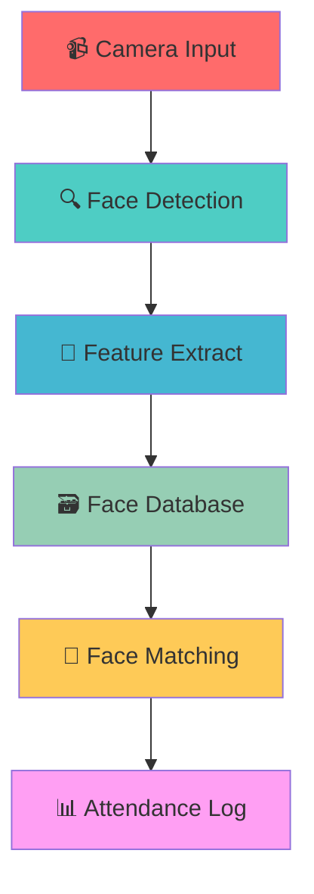

<div align="center">

# 🎯 Face Recognition Attendance System


[](https://opensource.org/licenses/MIT)
[](https://www.python.org/downloads/)
[](https://flask.palletsprojects.com/)
[](https://opencv.org/)
[](CONTRIBUTING.md)


### 🚀 Sistem absensi otomatis menggunakan teknologi computer vision dan machine learning untuk mengenali wajah karyawan secara real-time dengan antarmuka web yang modern dan premium.


</div>

---

## ✨ Features

<table>
<tr>
<td width="50%">

### 🎥 **Core Features**
- 🔍 **Real-time Face Recognition** - Deteksi dan pengenalan wajah secara langsung
- 🌐 **Modern Web Interface** - UI/UX premium dengan animasi dan efek visual
- 📱 **Responsive Design** - Berfungsi di desktop, tablet, dan mobile
- 🔒 **Anti-duplicate System** - Mencegah absen ganda dalam satu hari
- 📊 **Data Analytics** - Dashboard dengan statistik kehadiran

</td>
<td width="50%">

### 🎨 **Premium Effects**
- ✨ **Glassmorphism** - Efek kaca transparan modern
- 🎭 **3D Tilt Effects** - Animasi kartu 3D interaktif
- 💫 **Neon Glow** - Efek cahaya neon yang memukau
- 🎪 **Floating Animations** - Elemen melayang yang smooth
- 🧲 **Magnetic Buttons** - Tombol yang tertarik ke mouse

</td>
</tr>
</table>

<div align="center">

</div>

---

## 🚀 Quick Start

<div align="center">

</div>

### 📋 Prerequisites

```bash
✅ Python 3.8+
✅ Webcam/Camera  
✅ Modern web browser (Chrome, Firefox, Edge)
```

### 🛠️ Installation

<details>
<summary>📦 <b>Click to expand installation steps</b></summary>

```bash
# 📥 Clone repository
git clone https://github.com/yourusername/face-recognition-attendance.git
cd face-recognition-attendance

# 🐍 Create virtual environment
python -m venv venv

# ⚡ Activate virtual environment
# Linux/macOS:
source venv/bin/activate
# Windows:
venv\Scripts\activate

# 📦 Install dependencies
pip install -r requirements.txt

# 🚀 Run application
python app.py
```

</details>

<div align="center">

### 🌐 Akses aplikasi di: **http://localhost:5000**


</div>

---

## 📖 Usage Guide

<div align="center">

</div>

<table>
<tr>
<td width="25%" align="center">

<h3>1️⃣ Register</h3>
<p>Daftarkan wajah karyawan baru</p>
</td>
<td width="25%" align="center">

<h3>2️⃣ Scan</h3>
<p>Sistem otomatis mengenali wajah</p>
</td>
<td width="25%" align="center">

<h3>3️⃣ Analytics</h3>
<p>Lihat data dan statistik</p>
</td>
<td width="25%" align="center">

<h3>4️⃣ Export</h3>
<p>Download laporan CSV</p>
</td>
</tr>
</table>

### 🎯 Detailed Steps

<details>
<summary>👤 <b>1. Register Employee Face</b></summary>

- 🌐 Kunjungi `/register`
- ✍️ Masukkan nama karyawan
- 📸 Ambil foto dengan kamera
- ✅ Klik "Daftarkan Wajah"

</details>

<details>
<summary>🎥 <b>2. Attendance System</b></summary>

- 📊 Dashboard utama menampilkan live camera
- ⏰ Sistem otomatis mengenali wajah setiap 3 detik
- 👆 Atau klik "Scan Wajah" untuk manual scan
- 💾 Data kehadiran tersimpan otomatis

</details>

<details>
<summary>📈 <b>3. View Attendance Data</b></summary>

- 📋 Kunjungi `/attendance`
- 🔍 Filter data berdasarkan tanggal
- 📊 Export ke CSV
- 📈 Lihat statistik real-time

</details>

<details>
<summary>🔧 <b>4. Camera Diagnostics</b></summary>

- 🛠️ Kunjungi `/camera-test`
- 🔍 Test kamera dan troubleshooting
- 📊 Monitor performance metrics
- 📥 Download diagnostic report

</details>

---

## 🏗️ Architecture

<div align="center">

</div>


```mermaid
graph TD
    A[📹 Camera Input] --> B[🔍 Face Detection]
    B --> C[🧠 Feature Extract]
    C --> D[🗃️ Face Database]
    D --> E[🔄 Face Matching]
    E --> F[📊 Attendance Log]
    
    style A fill:#ff6b6b
    style B fill:#4ecdc4
    style C fill:#45b7d1
    style D fill:#96ceb4
    style E fill:#feca57
    style F fill:#ff9ff3
```

### 🛠️ Tech Stack

<div align="center">

| Backend | Frontend | Computer Vision | Database | UI/UX |
|---------|----------|----------------|----------|-------|
|  |  |  |  |  |
|  |  |  |  |  |

</div>

---

## 📁 Project Structure

<div align="center">

</div>

```
🎯 face-recognition-attendance/
├── 📂 static/
│   ├── 🎨 css/
│   │   ├── ✨ style.css           # Main styling
│   │   ├── 🎭 effects.css         # Premium effects
│   │   ├── 📝 text-fixes.css      # Text visibility
│   │   └── 📷 camera-test.css     # Camera diagnostics
│   ├── ⚡ js/
│   │   ├── 🧠 app.js             # Core JavaScript
│   │   └── 🎪 premium-effects.js  # Interactive effects
│   └── 🎯 favicon.svg            # App icon
├── 🌐 templates/
│   ├── 🏠 index.html             # Dashboard
│   ├── 👤 register.html          # Face registration
│   ├── 📊 attendance.html        # Data viewer
│   └── 🔧 camera_test.html       # Diagnostics
├── 👥 faces/                     # Face database
├── 🚀 app.py                     # Flask application
├── 🤖 face_recognition.py        # CLI version
├── 📝 register_face.py           # CLI registration
├── 📈 view_attendance.py         # CLI data viewer
├── 📊 attendance.csv             # Attendance data
├── 📦 requirements.txt           # Dependencies
├── 📖 README.md                  # Documentation
├── ⚖️ LICENSE                    # MIT License
├── 🤝 CONTRIBUTING.md            # Contribution guide
├── 📋 CODE_OF_CONDUCT.md         # Code of conduct
└── 🚀 run.sh                     # Launch script
```

---

## 🎨 UI/UX Features

<div align="center">

</div>

<table>
<tr>
<td width="33%" align="center">

<h3>✨ Glassmorphism</h3>
<p>Modern glass-like effects</p>
</td>
<td width="33%" align="center">

<h3>🎭 3D Animations</h3>
<p>Interactive 3D card tilt</p>
</td>
<td width="33%" align="center">

<h3>💫 Neon Effects</h3>
<p>Glowing elements</p>
</td>
</tr>
<tr>
<td width="33%" align="center">

<h3>🎪 Floating</h3>
<p>Smooth floating elements</p>
</td>
<td width="33%" align="center">

<h3>🧲 Magnetic</h3>
<p>Mouse-attracted buttons</p>
</td>
<td width="33%" align="center">

<h3>📱 Responsive</h3>
<p>All screen sizes</p>
</td>
</tr>
</table>

---

## 🔧 Configuration

<div align="center">

</div>

### ⚙️ Adjust Recognition Sensitivity
```python
# 🎯 In face_recognition.py
best_score = 0.7  # Lower = more sensitive (0.5-0.8)
```

### ⏱️ Change Cooldown Timer
```python
# ⏰ Auto-scan interval
recognition_cooldown = 3  # seconds between auto-scans
```

### 🔍 Modify Detection Parameters
```python
# 📷 Face detection settings
faces = face_cascade.detectMultiScale(gray, 1.1, 4)
#                                    scale, neighbors
```

---

## 📊 Performance Metrics

<div align="center">

</div>

<table align="center">
<tr>
<td align="center">

</td>
<td align="center">

</td>
</tr>
<tr>
<td align="center">

</td>
<td align="center">

</td>
</tr>
</table>

### 🌐 Browser Support

<div align="center">


</div>

---

## 🤝 Contributing

<div align="center">

</div>

We welcome contributions! Please see our [Contributing Guide](CONTRIBUTING.md) for details.

### 🚀 Quick Contribution Steps

```bash
1️⃣ Fork the repository
2️⃣ Create feature branch: git checkout -b feature/amazing-feature
3️⃣ Commit changes: git commit -m 'Add amazing feature'
4️⃣ Push to branch: git push origin feature/amazing-feature
5️⃣ Open a Pull Request
```

<div align="center">

### 🏆 Contributors

<a href="https://github.com/yourusername/face-recognition-attendance/graphs/contributors">
  
</a>

</div>

---

## 🐛 Issues & Support

<div align="center">

</div>

<table>
<tr>
<td align="center">
<a href="https://github.com/yourusername/face-recognition-attendance/issues">

</a>
</td>
<td align="center">
<a href="https://github.com/yourusername/face-recognition-attendance/issues">

</a>
</td>
</tr>
<tr>
<td align="center">
<a href="https://github.com/yourusername/face-recognition-attendance/discussions">

</a>
</td>
<td align="center">
<a href="mailto:support@yourproject.com">

</a>
</td>
</tr>
</table>

---

## 📝 License

<div align="center">

</div>

This project is licensed under the MIT License - see the [LICENSE](LICENSE) file for details.

<div align="center">

[](https://opensource.org/licenses/MIT)

</div>

---

## 🙏 Acknowledgments

<div align="center">

</div>

<table>
<tr>
<td align="center">

<br><sub>Computer vision tools</sub>
</td>
<td align="center">

<br><sub>Web framework</sub>
</td>
<td align="center">

<br><sub>UI components</sub>
</td>
</tr>
</table>

---

## 🔮 Roadmap

<div align="center">

</div>

<table>
<tr>
<td width="50%">

### 🔥 **Phase 1 - AI Enhancement**
- [ ] 🧠 Deep learning integration (CNN)
- [ ] 👥 Multi-face simultaneous recognition
- [ ] 🎯 Improved accuracy algorithms
- [ ] 🔍 Liveness detection
- [ ] 🎭 Mask detection support

</td>
<td width="50%">

### 🚀 **Phase 2 - Platform Expansion**
- [ ] 🗄️ Database integration (PostgreSQL/MySQL)
- [ ] 🌐 REST API development
- [ ] 📱 Mobile app (React Native)
- [ ] 🐳 Docker containerization
- [ ] ☁️ Cloud deployment guides

</td>
</tr>
<tr>
<td width="50%">

### 📊 **Phase 3 - Analytics & Integration**
- [ ] 📈 Advanced analytics dashboard
- [ ] 🔔 Real-time notifications
- [ ] 🏢 LDAP/Active Directory integration
- [ ] 💼 HR system integration
- [ ] 📊 Business intelligence reports

</td>
<td width="50%">

### 🌟 **Phase 4 - Enterprise Features**
- [ ] 🔐 Advanced security features
- [ ] 🌍 Multi-language support
- [ ] 🎨 Custom themes
- [ ] 📡 IoT device integration
- [ ] 🤖 AI-powered insights

</td>
</tr>
</table>

---

## 📞 Contact

<div align="center">

</div>

<div align="center">

[](https://github.com/yourusername)
[](mailto:your.email@example.com)
[](https://linkedin.com/in/yourprofile)
[](https://twitter.com/yourusername)

</div>

---

<div align="center">


### ⭐ **Star this repository if you find it helpful!** ⭐


**Made with ❤️ by developers, for developers**

</div>